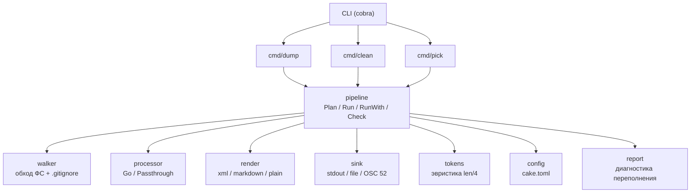
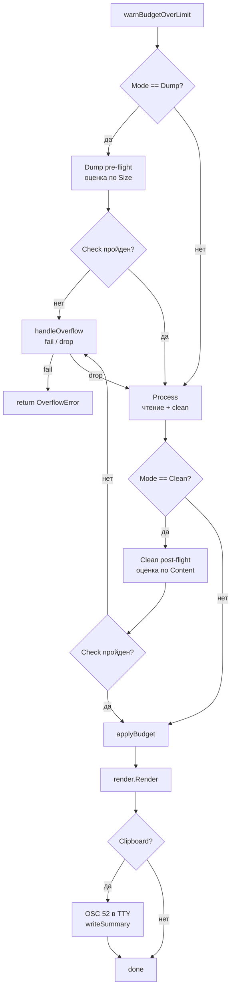
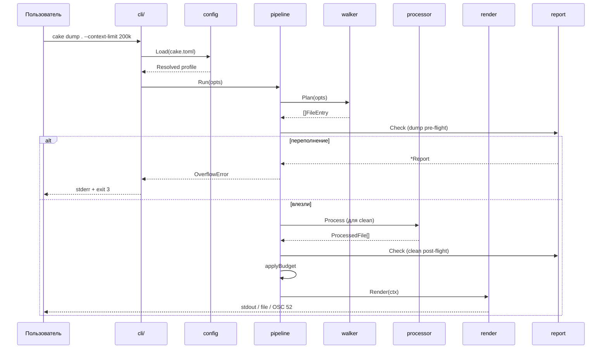

# Architecture

## Общая схема



## Пакеты

### `internal/walker`
Отвечает за обход ФС и фильтрацию.

- `Walk(root string, opts Options) ([]FileEntry, error)`
- Учитывает `.gitignore` (корневой + вложенные).
- Исключает: `.git/`, `node_modules/`, `vendor/`, бинарные файлы,
  симлинки с зацикливанием.
- Возвращает отсортированный список для детерминированного вывода.
- `Tree(entries)` — ASCII-дерево с `├──` / `└──`.

### `internal/processor`
Интерфейс мультиязычной обработки — задел под расширение.

```go
type Processor interface {
    Supports(path string) bool
    Language(path string) string
    Process(path string, src []byte, opts Options) (Result, error)
}
```

Реализации в v0.x:
- `GoProcessor` — парсит через `go/ast`, умеет strips-comments.
- `Passthrough` — отдаёт файл как есть.

Реестр — срез `[]Processor`, поиск `For(path)`.
`processor.Language(path)` — единая точка правды по расширениям,
используется walker'ом и рендером.

### `internal/render`
Форматирование результата.

- `xml.go` — тегированный вывод (основной).
- `markdown.go` — заголовки + code-блоки.
- `plain.go` — для отладки.
- `overhead.go` — оценка обвязки формата (теги, дерево, CDATA-маркеры)
  прогоном настоящего рендера с пустым содержимым. Используется
  pipeline для оценки токенов: `overhead_bytes + content_tokens`.

Вход — `Context` (метаданные + список обработанных файлов),
выход — `io.Writer`.

### `internal/config`
Читает `cake.toml`: локальный — вверх от `Root` до `.git` или корня ФС,
глобальный — `$XDG_CONFIG_HOME/cake/config.toml` или
`os.UserConfigDir()/cake/config.toml`.

Строгий разбор (`DisallowUnknownFields`), `version = 1`,
профили с неявным наследованием `[default]`. `reserve` не наследуется
профилем, переопределившим `context-limit` (review §D11).

Приоритет слияния:

```
CLI (Changed) > профиль > [default] (локальный)
             > глобальный [default] > встроенные дефолты
```

Скаляры: побеждает более приоритетный. Списки (`include`, `exclude`):
дополняются; `--exclude ''` — явный сброс.

### `internal/report`
Диагностика переполнения контекста.

- `Aggregate(items, top)` — агрегация по директориям в стиле ncdu:
  спуск от корня, пока один дочерний узел держит >50% веса родителя.
- `AggregateExt(items, top)` — по расширениям.
- `Omitted(items)` — схлопывание отброшенного; контракт — сумма
  `Files` по бакетам равна числу входных items.
- `excludeMeasure` — жадный набор `-e`-паттернов с пересчётом
  эффекта через `doublestar.Match`, без двойного счёта вложенных
  директорий.
- `WriteJSON` — `schema: 1` для CI.

`Report` — структура данных; текст (`Write`) и JSON (`WriteJSON`) —
её представления.

### `internal/tui`
Bubbletea-модель поверх `pipeline`.

- Дерево файлов с чекбоксами.
- Состояние: `selected map[string]bool`, `cursor int`, `offset int`,
  `filter string`, `treeMode bool`.
- Live-оценка токенов и индикатор лимита в статусной строке.
- На `enter` — вызывает `pipeline.RunWith` (через `cli/pick.go`).

### `internal/pipeline`
Оркестрация. Единственное место, где встречаются все слои.

```go
type Options struct {
    Root         string
    Includes     []string
    Excludes     []string
    MaxSize      int64
    Output       string
    Mode         Mode          // Dump | Clean
    Format       Format        // XML | Markdown | Plain
    KeepDoc      bool
    UseGitignore bool
    Budget       int           // жёсткий потолок
    Clipboard    bool

    ContextLimit int           // лимит модели
    Reserve      int           // резерв под system prompt + ответ
    OnOverflow   OverflowMode  // Fail | Drop

    Report       io.Writer
    ReportFile   string
    Summary      io.Writer
}

func Plan(opts Options) ([]FileEntry, error)
func Run(opts Options) error
func RunWith(opts Options, files []FileEntry) error

// Единственная точка проверки лимита. Зовётся из RunWith
// и из cli/pick.go после подтверждения.
func Check(opts Options, entries []FileEntry, in CheckInput) *report.Report
```

Порядок в `RunWith`:



`*OverflowError` из `Check` → `errors.As` в `main.go` → exit 3.

### `internal/tokens`
Оценка токенов.

- `Estimate(src []byte) int` — быстрая эвристика (`len/4`).
- `EstimateSize(n int64) int` — по размеру (TUI, pre-flight).
- `ParseCount("200k")`, `ParseReserve("10%", limit)`,
  `DefaultReserve(limit)`.

Позже — `tiktoken` как опция.

### `pkg/types`
Общие типы: `FileEntry`, `ProcessedFile`, `OmittedDir`, `Context`.

## Формат вывода (v0.1)

```xml
<context project="myproject" files="42" tokens="18432">
  <tree><![CDATA[
  ├── cmd/
  │   └── main.go
  └── internal/walker/walker.go
  ]]></tree>

  <file path="cmd/main.go" lang="go" lines="24" bytes="512">
  <![CDATA[
package main
...
  ]]>
  </file>
</context>
```

При отброшенных файлах добавляются `dropped="N"` на `<context>`
и `<omitted count="N">` со схлопнутыми директориями.

## Поток данных



TUI-режим отличается только источником списка файлов:
вместо `walker.Walk` — модель `tui`, которую пользователь редактирует.

## Принципы

- **Один конвейер, три входа.** TUI и CLI не расходятся.
- **Один источник правды для проверки.** `pipeline.Check` — единственное
  место, где решается «влезли или нет».
- **Один источник правды для оценки обвязки.** `render.Overhead`
  считается прогоном настоящего рендера, поэтому правка шаблона
  автоматически попадает в оценку.
- **Стриминг.** Не буферизуем больше одного файла за раз (кроме tiny preview).
- **Детерминизм.** Сортировка по пути, стабильный вывод — важно для diff.
- **Ноль глобального состояния.** Все зависимости — через опции.
